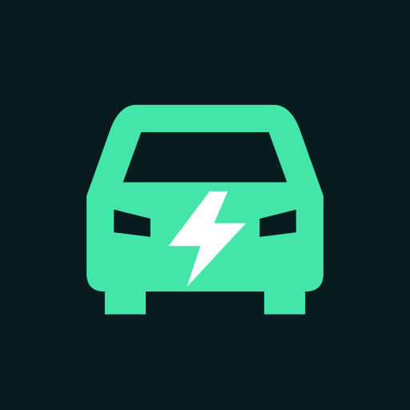

  
  <h1>NexRoute</h1>
  
<strong>Your route. Your EV. A clearer charging plan.</strong>

  
Plan electric journeys across Germany with battery estimates, suggested charging stops and turn-by-turn navigation.

  
 
  

  
<a href="#download">Download APK</a> · <a href="https://nexquantum.de">NexQuantum website</a> · <a href="#android-auto">Request Android Auto Access</a>

---

## Less guesswork between charging stops

Choose a destination, select your vehicle and enter your current battery level.
NexRoute brings the road route, estimated arrival battery and suggested charging
stops together, so you can make an informed plan before setting off.

**Currently a development preview, not a stable production release.** Battery
estimates and charger data are planning aids, not guarantees of range or availability.

## Built for your electric journey

| Before you leave | On the road |
| --- | --- |
| **Your vehicle profile.** Save multiple vehicles with battery capacity, consumption, connectors and maximum DC charging power. | **Turn-by-turn guidance.** Road routes, spoken instructions and map-following navigation. |
| **Battery-aware planning.** Set departure charge and arrival reserve; see estimated energy and arrival charge. | **Charging stops.** Review suggested stops and their estimated arrival/departure charge and charging time. |
| **Charging preferences.** Choose operators/providers and compatible connectors. Station details show available information. | **Quick destinations.** Reuse saved places and recent destinations. |
| **Downloadable maps.** Keep German regional map packages on your device. | **Day and night.** Light/dark appearance and a landscape-friendly layout. |

Offline **maps** do not mean offline **route calculation**: new road routes and
online address search still require network services. Battery values are entered
manually; NexRoute does not read live battery telemetry from your car. Provider
preferences do not guarantee roaming, tariff acceptance or a free charging bay.

## A closer look

Real screenshots are being prepared. The spaces below intentionally do not
simulate the app or show mock data as finished functionality.

| Plan your route | Make it your vehicle | Follow the journey |
| :---: | :---: | :---: |
| **Phone preview coming** | **Phone preview coming** | **Phone preview coming** |
| Destination, charge and reserve | Vehicle profile and connectors | Map, guidance and arrival estimate |

<!-- SCREENSHOT: assets/screenshots/phone/route-plan-light.png -->
<!-- SCREENSHOT: assets/screenshots/phone/vehicle-profile-light.png -->
<!-- SCREENSHOT: assets/screenshots/phone/navigation-dark.png -->

More product previews

| Charging plan | Downloaded maps | Android Auto |
| :---: | :---: | :---: |
| **Screenshot coming** | **Screenshot coming** | **Testing preview coming** |
| Suggested stop and charge estimates | Installed German region | Navigation and EV trip information |

<!-- SCREENSHOT: assets/screenshots/phone/charging-plan-light.png -->
<!-- SCREENSHOT: assets/screenshots/phone/offline-maps-light.png -->
<!-- SCREENSHOT: assets/screenshots/android-auto/navigation-light.png -->
<!-- SCREENSHOT: assets/screenshots/android-auto/saved-places-dark.png -->

## Download

| | Availability |
| --- | --- |
| Latest stable APK | **Not published yet** |
| Current test build | **0.3.13 (20)** — public APK release pending |
| Public release date | Not yet published |
| Minimum Android | **Android 8.0 / API 26** |
| Architecture | **arm64-v8a** — 64-bit ARM devices; no x86 emulator APK |
| Android Auto | Separate, limited Google Play testing access |

The APK will be attached to a **GitHub Release**, not committed to this repository.
Once available, use the APK asset in that release; the automatic “Source code” ZIP
is **not** an Android installer.

<!-- RELEASE_LINKS: replace pending state only after verifying the actual repository and release.
Stable CTA: https://github.com/NexTechQuantum/NexRoute-Releases/releases/latest
Prerelease list: https://github.com/NexTechQuantum/NexRoute-Releases/releases
Never label a prerelease Stable; /latest excludes prereleases.
-->

[Read the current build notes](release-notes/0.3.13.md). Only install packages from
official NexQuantum releases. A directly installed APK may use a different signing
certificate from Google Play and may not update a Play-installed copy in place.
Do not uninstall without preserving anything you need: local app data can be lost.

## Android Auto

**Android Auto — Limited Testing**

Search for a destination, open saved places and start navigation on the car
display. The test integration also exposes saved vehicles, manual battery/reserve
adjustments and charging-plan information. Car-screen controls follow Android Auto
templates and can differ from the phone interface.

Android Auto is currently distributed through **Google Play testing**. Installing
the standalone phone APK does not grant access to that test. Invitations are
reviewed manually; a request is not a promise of access or an automatic enrollment.

**Request Android Auto Access — form opening soon.** The secure form will ask for
the Google Account email you use with Google Play. Please **do not post that email
in GitHub Issues, discussions or pull requests**.

<!-- ACCESS_FORM: replace this pending CTA with the verified HTTPS URL after hosting is confirmed.
Isolated hosting only: never deploy over the existing nexquantum.de panel.
-->

## Privacy, by design and in plain language

No account is needed to use the phone app. Vehicle profiles and saved places stay
on your device. Online routing sends route coordinates to our backend. Optional
community reports and support messages are stored as described in the policy;
random report identifiers are pseudonymous, not fully anonymous. There is no
advertising or analytics SDK in the reviewed build.

[Privacy policy](https://169-58-67-137.sslip.io/privacy) ·
[Request data deletion](https://169-58-67-137.sslip.io/data-deletion)

The Android Auto application form has its own short privacy notice before sending.
Your Google Play email is used to review your request and, if accepted, invite you
to the test—not published on GitHub or subscribed to marketing.

## Useful to know

- Coverage and datasets currently focus on **Germany**.
- Station status, tariffs and speed limits may be incomplete or unavailable.
- Follow road signs and traffic rules. Check charging availability independently.
- Use phone settings only while safely parked. Never create false public road
  reports just to test the interface.

  
<strong>NexRoute by NexQuantum</strong> Electric journeys, thoughtfully planned.

  
<a href="https://nexquantum.de">Website</a> · <a href="mailto:support@nexquantum.de">Support</a>

  This repository contains product information and release downloads—not the private NexRoute source code.

